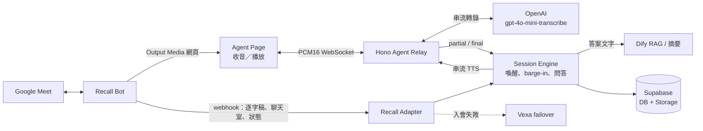

# 🟢 即時語音 Agent 架構

> 最後對齊：2026-07-22。此文件描述目前程式碼的語音路徑；延遲問題的歷史根因見 [16-語音延遲根因分析報告.md](16-語音延遲根因分析報告.md)。

## 目標

讓繁中／中英混雜的會議語音能以串流方式完成「聽見 → 偵測喚醒 → 回應」，同時不重寫既有問答、聊天室、逐字稿、摘要與 provider failover。

## 現行總體架構

### 元件與責任邊界

| 元件 | 責任 | 不負責 |
|---|---|---|
| Recall Bot + Output Media | 進入 Meet、提供 bot 瀏覽器與會議音訊/視訊載體 | 語音理解與回答決策 |
| Agent Page | `getUserMedia` 收音、PCM16 上傳、jitter buffer 播放、顯示聆聽/說話狀態 | 保存會議狀態或呼叫 Dify |
| Agent Relay | 對 OpenAI 串流 STT、轉發 partial/final、串流 TTS、播放停止與心跳 | 意圖分類與商業規則 |
| Session Engine | 喚醒詞、待命窗、去重、barge-in、問答路由、插話與破冰 | 音訊編解碼與 WebSocket 協定 |
| Recall Adapter | provider 統一介面、bot 生命周期、webhook、agent 失效時的舊路徑回退 | 上層 provider 條件分支 |
| Dify / Supabase | RAG 與摘要；會議資料的永久保存 | 即時語音傳遞 |

## 關鍵資料流

### 1. 語音喚醒與回答

1. Agent Page 每 100ms 將 24kHz、mono PCM16 傳給 `/ws/agent`。
2. Relay 將音訊送到 OpenAI 轉錄 session；轉錄 delta 累積成 partial，定稿轉成 final。
3. partial/final 使用既有 `LiveHandlers` 進入 `wake-word-detector`，沿用喚醒詞 regex、待命窗、debounce 與問答流程。
4. 固定 ack 優先播放已預熱 PCM；其他回答由 OpenAI TTS 以 PCM 串流送回頁面，頁面累積 0.5 秒 jitter buffer 後播放。
5. 人聲進來時既有 barge-in 邏輯呼叫 `stopSpeaking`；Relay 增加 epoch 並發 `stop`，頁面立即清空佇列。

### 2. webhook 與逐字稿

- `participant_events.chat_message` 永遠走 webhook，聊天室問答不受 agent 模式影響。
- `transcript.data` 在 agent 在線時仍保存為會後逐字稿，但**不再觸發語音喚醒**，避免 Recall 的延遲轉錄造成重複回答。
- Agent Page 或 OpenAI 轉錄斷線時，`isAgentLive` 變為 false；webhook 的語音喚醒與 mp3 播放自動恢復，優先可用而非保持無聲。

### 3. 會議結束

Session Manager 先從 `activeSessions` 移除 session，防止重複收尾；接著結束 bot、合併語音與聊天室紀錄、寫入 Storage 並非同步觸發 Dify 摘要。此流程沒有因即時語音改造而改變。

## 運作模式與回退

| 條件 | 語音輸入／輸出 | 結果 |
|---|---|---|
| `AGENT_MODE=on` 且頁面與轉錄鏈皆在線 | Agent PCM 串流／串流 TTS | 低延遲主路徑 |
| Agent Page 或 OpenAI 斷線 | Recall webhook／既有 mp3 | 自動降級，功能可用但延遲變高 |
| `AGENT_MODE=off` | Recall webhook／既有 mp3 | 完整回到舊路徑 |
| Recall 入會失敗 | FailoverProvider → Vexa | 保留既有備援行為；不享有 Agent 低延遲 |

`AGENT_MODE=on` 還需要 `AGENT_PAGE_URL`、`OPENAI_API_KEY`、`RECALL_WEBHOOK_URL` 與 `RECALL_WEBHOOK_TOKEN`；設定不完整時不掛載 gateway，安全維持舊路徑。

## 部署與限制

- Agent Page 必須能從 Recall bot 瀏覽器公開存取；開發環境由 cloudflared tunnel 提供網址。
- Agent WebSocket token 以 `RECALL_WEBHOOK_TOKEN` 對 agentId 做 HMAC 簽章；未驗證連線一律拒絕。
- `activeSessions` 與 agent registry 都在記憶體，因此仍只能用單一 Node.js 進程（PM2 fork mode），不可水平擴展。
- 會議逐字稿仍以 provider webhook 為會後資料來源；Agent STT 是低延遲控制路徑，不取代既有摘要資料生命週期。

## 驗收指標

| 指標 | 目標 |
|---|---|
| 說出「蜜塔」到 ack | < 1.5 秒 |
| 問題結束到答案首音 | Dify 查詢時間 + 約 2 秒內 |
| 蜜塔說話時插話到靜音 | < 0.5 秒 |
| Agent 失效 | 自動切回 webhook + mp3，不中斷聊天室與會後摘要 |
